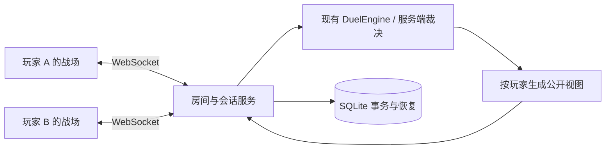

# 单局 PVP 服务

首页选择「联机对战」，即可与另一位玩家进行一场真实决斗。服务器运行项目现有的完整规则引擎，玩家的浏览器负责显示局面和提交选择。

## 立即开始

开发环境推荐 Node.js 24 LTS；最低 22.13。Windows 使用 `npm.cmd`，其他系统使用 `npm`。

```powershell
npm.cmd ci
npm.cmd run build
npm.cmd run start:pvp
```

打开 <http://127.0.0.1:4173/#pvp>。`npm start` 现在也会启动同一服务。

1. 填写昵称，选择预设或已保存的自建卡组。
2. 创建公开／私密房间，复制房间码或邀请链接给朋友。公开房间也可以从大厅入座。
3. 双方点击「准备决斗」，服务器随机决定先后攻并开始。
4. 在原有战场中召唤、发动、选择素材、连锁和攻击。顶部显示双方思考时间、网络延迟和房间入口。
5. 胜负由服务器确认。结算页可以「返回房间」，也可以直接「离开房间」回到联机大厅；房间页也保留清晰的离开按钮。双方留在房间并同意「再战一局」后，可以重新选牌、准备，开始独立的新一局。

「快速匹配」使用选定卡组进入队列，自动匹配另一位在线玩家，采用每人 5 分钟、每个自己的新回合恢复 20 秒的设置。匹配前可以取消。

赛后点击「再战一局」，对方会收到带你昵称的「已准备，希望与你再战一局」提醒。房间和结算页都会持续展示邀请；留在战场时，顶部的结果入口会标记为「再战邀请」。对方点击「同意再战」后进入卡组准备，任意一方准备完成，也会提醒另一方。只有双方确认卡组并准备后才开始新一局。

提醒按服务器的当前状态显示，刷新／重连后仍可看到；重复同步不会反复弹出相同提示，取消准备或离开房间后会清除对应提示。

本机自测请使用两个独立浏览器窗口／无痕窗口。直接复制已有标签页可能复制会话凭证；同一凭证重新连接会接管原来的席位，而不会变成第二位玩家。

## 局域网和公网

直接启动的服务默认监听 `0.0.0.0:4173`。局域网玩家使用服务器电脑的局域网 IP，例如 `http://192.168.1.10:4173/#pvp`。从这个地址复制邀请链接，朋友才能直接打开；`127.0.0.1` 只代表各自的电脑。需要允许系统防火墙放行所选端口。

公网使用域名与 HTTPS，浏览器会自动升级为 WSS。仓库提供 Docker、Compose 和 Caddy 配置：

```sh
# 先确保 index.html 已用最新源码构建，再启动容器
docker compose up -d --build
# 默认只将后端发布到本机 http://127.0.0.1:4173
```

HTTPS 部署：复制 `.env.example` 为 `.env`，将 `DUEL_DOMAIN` 改为已指向服务器的域名，再运行：

```sh
docker compose --profile https up -d --build
```

Caddy 负责证书与 WebSocket 反向代理，入口为 `https://你的域名/#pvp`。开放 80／443 端口，后端 4173 保持仅本机可达。若需要以容器直接提供局域网 HTTP 服务，将 `.env` 中的 `DUEL_BIND_ADDRESS` 改为 `0.0.0.0`。

Docker 镜像运行已构建的根目录 `index.html` 和服务端源码，只安装生产依赖，以非 root 用户运行。卡图／配乐仍采用 HTML 内嵌资源。数据使用 `pvp-data` 命名卷，容器更新后保留。`docker compose down` 保留数据；带 `-v` 会删除数据卷。

GitHub Pages 或双击 HTML 继续支持离线游玩。它们不会自动产生 PVP 后端；联机入口会提示打开实际服务器地址。`npm run start:static` 保留原来的本地静态开发服务器。

## 对局规则与边界

| 项目 | 行为 |
| --- | --- |
| 赛制 | BO1，一场独立决斗；不组建赛事、积分赛或三局两胜 |
| 起始 | 双方 8000 LP，随机 5 张起手；无起手保障；先攻随机 |
| 构筑 | 40–60 张主卡组、0–15 张额外、同名卡合计最多 3 张；服务端校验 |
| 卡池 | 沿用现有引擎的 5,754 张可组卡卡片及 38 套预设，也支持本地自建构筑 |
| 禁限与裁定 | 沿用项目自由构筑规则；不加载官方禁限表，不因年度筛选切换历史卡文 |
| 思考时间 | 公开／私密房间可选 3／5／10 分钟；每个自己的新回合恢复 20 秒，上限为初始时长 |
| 响应时间 | 当前需要响应／选择的一方计时；打开图鉴、查看日志或连锁演出时也不会停止思考计时 |
| 超时 | 思考时间用尽判负；无效操作、重复请求和刷新均不会重置时间 |
| 断线 | 每位玩家每局共享 60 秒重连额度，断线时暂停双方思考计时；反复重连会累计消耗额度 |
| 双方离线 | 等待仍在额度内的玩家恢复；双方额度均耗尽则结束为平局，防止按断线顺序给离线玩家判胜 |
| 认输 | 可以主动认输；对局中离开房间前需要先结束本局 |
| 自然平局 | 保留规则引擎产生的平局；不会擅自抽签判胜或自动安排重赛 |
| 对局保护 | 达到 2 小时或 5,000 次有效操作则记为保护平局 |
| 再战 | 双方在线并同意后重置准备状态，新建独立的 gameId 和结果记录 |

与原项目相同，这是一套自研规则实现，已有卡片的适配边界继续适用，详见各年度交接和 `CARD-ENGINE.md`。联机不会把现有的近似效果变成官方裁定实现。

## 数据、恢复与隐私

- 每个浏览器标签页使用独立的随机会话凭证，放在 `sessionStorage`；凭证不会进入邀请链接。数据库只保存凭证哈希。昵称不是账号，也不提供跨设备登录。
- 刷新、短暂网络中断后自动恢复原席位和服务器当前决策。尚未确认的本地多选需要重新点选，已经提交的出牌和代价不会再次执行。关闭标签页、清理站点数据或切换域名后，可能丢失该标签页的凭证。
- 同一凭证的新连接接管原连接，旧页面停止重连，避免两个页面争抢席位。
- 服务器负责随机数、洗牌、构筑校验、操作合法性、回合／响应归属、费用与胜负；客户端不能上传 LP、洗牌结果或完整局面。
- 每份视图只包含当前玩家应知的信息。对手的构筑、手牌、盖牌、里侧除外卡和未公开额外卡组不会以真实卡片数据下发。合法效果需要查看／选择的候选，只有相应决策者可见。
- 主卡组正常只下发数量；公开卡组顶等规则效果单独处理。卡片引用按玩家和局面版本转换为临时不可猜测标识，避免利用原始编号推断卡组排列或跟踪回到暗区的卡片。
- 日志按事件发生时的可见性分别生成；不直接转发旧卡片处理器中的自由文本，也不因后来公开而补出过去的隐藏信息。双方的日志和导出都遵循同一视角。
- 对局进展在广播前写入 SQLite 事务，最近 64 个请求编号保留幂等回执。确认过的操作在重连／重启后不会重复执行。
- 时钟每 5 秒保存检查点，正常停止时再次保存。异常断电最多可能返还上个检查点以来的少量思考时间；服务停机期间不会继续扣玩家时间。启动后按剩余重连额度等待玩家回来。
- PVP 不写入普通离线对局存档和单机胜率统计；返回离线模式时恢复原来的对局。

默认数据在 `.pvp-data/pvp.sqlite`，完整已结束对局在 `games` 表。等待房间闲置 30 分钟过期，结束房间保留 24 小时方便查看／再战，独立结果与最终快照保留 7 天；无活动且未加入房间的访客凭证保留 7 天。房间／会话清理会释放内存和数据库记录。

备份时停止服务后复制整个 `.pvp-data` 目录，或使用 SQLite 在线备份工具。WAL 模式下，不应在服务运行中只复制单个 `.sqlite` 文件。数据库含双方完整构筑和服务端局面，应放在私有数据目录；HTTP 静态服务不会发布它。

## 配置与运行

| 环境变量 | 默认 | 用途 |
| --- | --- | --- |
| `DUEL_HOST` | `0.0.0.0` | 直接运行 Node 时的监听地址；只在本机玩可设 `127.0.0.1` |
| `DUEL_PORT` | `4173` | 直接运行 Node 的端口／Compose 发布到宿主机的端口 |
| `DUEL_DATA_DIR` | 项目 `.pvp-data` | SQLite 私有目录，Docker 内固定为 `/data` |
| `DUEL_MAX_ROOMS` | `100` | 活跃／保留房间数量上限，1–1000 |
| `DUEL_ORIGINS` | 空 | 额外允许的 WebSocket 来源，逗号分隔；默认允许同源浏览器和无 Origin 的原生客户端 |
| `DUEL_TRUST_PROXY` | `0` | 为 `1` 时使用受信代理追加的来源 IP；仅在禁止直接访问后端的代理部署中开启 |
| `DUEL_BIND_ADDRESS` | `127.0.0.1` | 仅 Compose：宿主机发布地址 |
| `DUEL_DOMAIN` | `localhost` | 仅 Caddy／Compose HTTPS：公开域名 |

直接运行 npm 不自动读取 `.env`。可以设置 shell 环境变量，或运行 `node --env-file=.env server/index.mjs`。示例：

```powershell
$env:DUEL_HOST = '127.0.0.1'
$env:DUEL_PORT = '4175'
npm.cmd run start:pvp
```

`GET /api/health` 返回服务状态，存储故障时返回 503 并停止接受对局变更；`GET /api/pvp/info` 提供协议版本和基本配置。日志不输出玩家凭证或出牌载荷。

连接设置包括：WebSocket 32 KiB 输入上限、256 条全局连接、每来源 IP 12 条连接、每连接每秒恢复 20 条消息／突发 80 条、每来源 IP 每分钟至多 30 次新访客、未认证连接 10 秒超时、15 秒心跳和慢客户端断开保护。这些是第一版的资源保护边界，不是吞吐承诺。

此版是单进程房间服务。SQLite 提供重启恢复，但不提供多个进程间的房间同步；同一数据目录只启动一个实例，不要直接用 cluster／PM2 多实例负载均衡。扩展并发时应先按房间拆分执行进程，并增加跨实例会话路由。当前没有账号系统、天梯、观战席或运营后台。

## 结构与协议



| 文件 | 职责 |
| --- | --- |
| `server/index.mjs` | HTTP、WebSocket、心跳、限流、静态文件白名单、启动／停止 |
| `server/service.mjs` | 会话、房间、匹配、准备、时钟、幂等请求、断线和结果 |
| `server/engine.mjs` | 加载既有规则、系统随机数、构筑校验、事件可见性 |
| `server/projection.mjs` | 公开字段白名单、双方视角、临时卡片句柄、合法操作与候选 |
| `server/store.mjs` | SQLite WAL 与事务存储 |
| `src/pvp-client.js` | 重连传输、请求回执、远程战场展示接口 |
| `src/pvp-ui.js` / `src/pvp.css` | 大厅、邀请、匹配、准备、时钟与结算界面 |
| `src/game-v2.js` | 在既有战场中切换本地／服务器引擎，停用本地对手 AI |

WebSocket 路径 `/pvp/ws`，第一条消息为 `{type:"hello", version:1, name}`，重连时附带 `token`。之后的请求附带唯一 `id`：`profile`、`list`、`create`、`join`、`ready`、`queue`、`cancel-queue`、`act`、`validate`、`surrender`、`rematch`、`leave`。`act` 和 `validate` 必须带当前 `revision`，选择只能使用当前玩家视图提供的句柄。`ping`／`pong` 用于延迟显示。

服务器发送 `welcome`、`ack`、`error`、`lobby`、`room`、`clock`、`queue`、`left`、`replaced`。客户端以 `room` 的服务器局面为准，不做乐观规则结算；过期版本返回 `STALE` 并同步新局面。

## 验证

```powershell
npm.cmd run test:pvp
npm.cmd run test:pvp:browser
npm.cmd test
npm.cmd run test:browser
```

PVP 单元与网络检查使用真实引擎、临时 SQLite 和真实本地 WebSocket；覆盖隐私、非法操作、材料选择、计时、累计重连额度、幂等、自然开局胜利、认输／再战、服务器重启与完整模拟决斗。

浏览器检查使用两个互相独立的浏览器上下文打开正式 `index.html`，通过真实按钮创建／加入房间、准备、交接回合、操作三环连锁与弃牌代价、选择超量素材、刷新、断线、服务器重启、认输、再战及快速匹配。复杂连锁／素材部分使用明确的受控服务器局面；普通开局和网络通信使用真实服务。

浏览器报告与截图位于 `output/pvp-browser/`，全量规则报告位于 `output/v4-checks-report.json`。输出、SQLite、`.env` 不进入 Git。

### 本次交付验证（2026-09-14）

Windows、Node.js 24.13.0、本机 Microsoft Edge / Playwright 下执行：

| 检查 | 结果 |
| --- | --- |
| `npm test` | 5,098 项通过，0 失败；包含 46 项 PVP 单元／网络检查 |
| PVP 浏览器 | 13 组通过，0 页面异常；包含双浏览器、重启恢复、席位接管及 150% 字号手机战场 |
| 原有 `test:browser` | 20 组通过 |
| 原有 `test:experience` | 17 组浏览器检查通过；另 12 项规则检查已包含在全量测试中 |
| 正式 HTML 构建 | 成功，264 张内嵌卡图与原配乐保留 |
| 生产依赖审计 | npm 官方 registry 审计 0 项已知漏洞 |
| Compose 普通／HTTPS 配置 | 两种配置均通过 `docker compose config --quiet` |

合计 50 组浏览器检查。38 套预设均抽查了通过 PVP 协议执行的前 16 次操作，另有完整对局模拟。Docker 引擎在本机未启动，因此容器构建／启动及公网证书签发未实测；直接 Node 服务、真实 WebSocket 与 SQLite 恢复已验证。

2026-09-15 提交前再次通过 5,098 项全量检查和 13 组 PVP 浏览器检查。PVP 浏览器场景已覆盖具名再战／准备提醒、停留在结算页时收到邀请、重复同步去重、跨语显示、刷新恢复和取消准备清除提示。正式代码、测试、部署配置、文档与根目录 HTML 一并提交；运行数据库、真实环境配置、截图、报告和提交审计按 `.gitignore` 留在本机。
